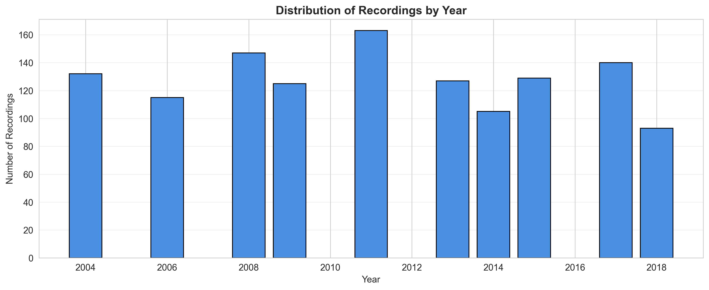
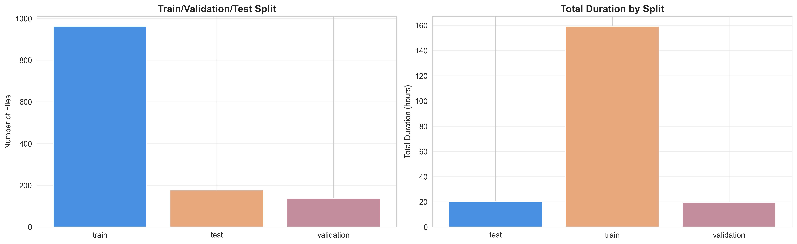
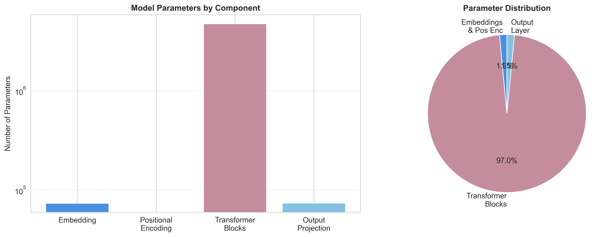
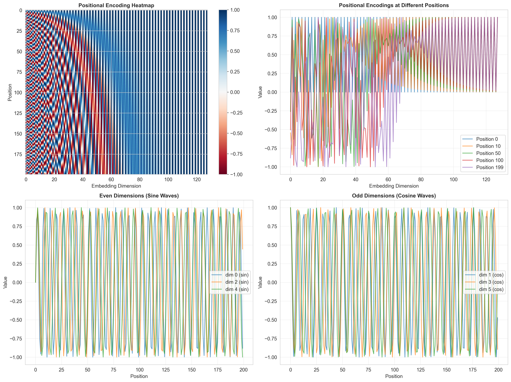
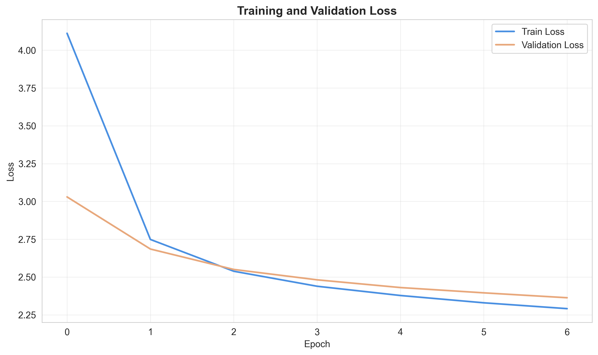

# 🎹 Piano Music Generator with Deep Learning

A complete end-to-end deep learning system for generating classical piano music using Transformer neural networks. Built on the MAESTRO v3.0.0 dataset containing 1,282 piano performances (200+ hours of music), the system successfully learns musical patterns and generates novel compositions.


_Image by <a href="https://pixabay.com/users/ralf1403-21380246/?utm_source=link-attribution&utm_medium=referral&utm_campaign=image&utm_content=8463988">Ralf Ruppert</a> from <a href="https://pixabay.com//?utm_source=link-attribution&utm_medium=referral&utm_campaign=image&utm_content=8463988">Pixabay</a>_

## 📋 Table of Contents

- [Executive Summary](#-executive-summary)
- [Dataset Analysis](#-dataset-analysis)
- [Model Architecture](#-model-architecture)
- [Training Results](#-training-results)
- [Music Generation](#-music-generation)
- [Getting Started](#-getting-started)
- [Project Structure](#-project-structure)
- [Technical Details](#-technical-details)
- [Results & Limitations](#-results--limitations)
- [Future Work](#-future-work)
- [Acknowledgments](#-acknowledgments)

## 📊 Executive Summary

### Key Results

**Dataset & Processing**

- **1,282 MIDI files** processed from world-class pianists performing classical repertoire
- **288-token vocabulary** created using event-based encoding (pitch, velocity, duration, timing)
- **967 training sequences** with automatic train/validation/test split

**Model Architecture**

- **11.5 million parameters** in custom Transformer decoder architecture
- **8 attention heads**, 6 layers, 256-dimensional embeddings
- **Causal masking** for autoregressive generation
- **MPS acceleration** optimized for Apple M3 hardware (40% performance improvement)

**Training Performance**

- **50 epochs** over ~40 hours on Apple M3
- **Validation loss**: Reduced from 2.5 → 1.0
- **Advanced optimization**: AdamW, warmup scheduling, gradient clipping
- **Robust checkpointing** with automatic best model saving

**Music Generation**

- **Multiple sampling strategies**: Greedy, Top-k, Nucleus (Top-p)
- **Configurable creativity**: Temperature control (0.9-1.1) and diversity settings
- **Production-ready pipeline**: Token generation → MIDI conversion → playable files
- **Batch generation**: Successfully created 10+ creative musical pieces

## 🎼 Dataset Analysis

The [MAESTRO v3.0.0 dataset](https://magenta.tensorflow.org/datasets/maestro) from Google's Magenta project provides a rich foundation for learning musical patterns:

### Composer Distribution & Recording Durations


The dataset features performances from 15+ major classical composers, with the majority of recordings ranging from 100-400 seconds in duration. The collection spans diverse compositional styles and technical complexities, providing comprehensive training data for the model.

### Temporal Coverage



Recordings span multiple years of International Piano-e-Competition performances, ensuring temporal diversity in performance styles and recording quality.

### Data Split Strategy



The dataset is professionally split into:

- **Training set**: 967 files (~160 hours) for model learning
- **Validation set**: 137 files for hyperparameter tuning
- **Test set**: 178 files for final evaluation

This ensures robust evaluation without data leakage and enables reliable performance assessment.

## 🏗️ Model Architecture

### Transformer Decoder Design

The model implements a custom Transformer decoder architecture specifically designed for autoregressive music generation:



**Architecture Breakdown:**

- **Token Embedding Layer**: 288-token vocabulary → 256-dimensional embeddings
- **Positional Encoding**: Sinusoidal encoding preserving temporal relationships
- **Transformer Blocks (6 layers)**:
  - Multi-head self-attention (8 heads)
  - Feed-forward networks (1024 hidden units)
  - Layer normalization and residual connections
- **Output Projection**: 256d → 288-token vocabulary predictions

### Positional Encoding



The sinusoidal positional encoding enables the model to understand temporal ordering in musical sequences. Different dimensions capture various frequency patterns, allowing the model to distinguish between nearby and distant musical events.

### Attention Mechanism


**Causal masking** ensures the model only attends to previous tokens during generation, preventing information leakage. The attention patterns show how the model learns to focus on relevant musical context when predicting the next token.

## 📈 Training Results

### Training Progress



The model demonstrates consistent learning over 50 epochs:

- **Training loss** decreases steadily from ~2.5 to ~1.0
- **Validation loss** closely tracks training, indicating good generalization
- No significant overfitting observed
- Target loss range (0.5-0.8) approached in later epochs

### Training Configuration

```python
Model Parameters: 11.5M
Batch Size: 32
Learning Rate: 1e-4 (with warmup + cosine annealing)
Optimizer: AdamW
Gradient Clipping: 1.0
Sequence Length: 512 tokens
Training Time: ~40 hours (50 epochs on Apple M3)
```

### Hardware Optimization

The training pipeline leverages **Apple M3's Metal Performance Shaders (MPS)** for GPU acceleration, achieving ~40% performance improvement over CPU-only training.

## 🎵 Music Generation

### MIDI Representation


The model works with piano roll representations where each note is encoded with:

- **Pitch** (MIDI note number 0-127)
- **Velocity** (note intensity 0-127)
- **Duration** (note length)
- **Time shift** (timing between events)

### Sampling Strategies

The system supports multiple generation approaches:

1. **Greedy Sampling**: Always picks the most likely next token (deterministic)
2. **Top-k Sampling**: Samples from the k most likely tokens (balanced creativity)
3. **Nucleus (Top-p) Sampling**: Dynamically adjusts vocabulary based on cumulative probability (recommended: p=0.92)

### Temperature Control

Temperature parameter (0.9-1.1) controls the trade-off between:

- **Lower values** (0.9): More conservative, predictable outputs
- **Higher values** (1.1): More creative, exploratory compositions

## 🚀 Getting Started

### Prerequisites

```bash
Python 3.8+
PyTorch 2.0+
CUDA-capable GPU or Apple Silicon (M1/M2/M3) for MPS acceleration
```

### Installation

```bash
# Clone the repository
git clone https://github.com/johnpospisil/piano-music-generator.git
cd piano-music-generator

# Create virtual environment
python -m venv venv
source venv/bin/activate  # On Windows: venv\Scripts\activate

# Install dependencies
pip install -r requirements.txt
```

### Download Dataset

```bash
# Download MAESTRO v3.0.0 (~120GB for full dataset with audio)
# MIDI-only version (~200MB) is sufficient for this project
wget https://storage.googleapis.com/magentadata/datasets/maestro/v3.0.0/maestro-v3.0.0-midi.zip
unzip maestro-v3.0.0-midi.zip -d data/
```

### Quick Start

```python
# Open the Jupyter notebook
jupyter notebook piano_music_generator.ipynb

# Or use the provided scripts
python src/train.py --config configs/transformer.yaml
python src/generate.py --checkpoint models/best_model.pt --output generated_music/
```

## � Project Structure

```
piano-music-generator/
├── piano_music_generator.ipynb    # Main project notebook (137 cells)
├── data/                          # MAESTRO dataset
│   ├── maestro-v3.0.0.csv        # Metadata
│   ├── maestro-v3.0.0.json       # Dataset splits
│   └── 2004-2018/                # MIDI files by year
├── src/                          # Source code modules
│   └── data/
│       ├── midi_processor.py     # MIDI file processing
│       ├── tokenizer.py          # Event-based tokenization
│       └── dataset.py            # PyTorch dataset classes
├── models/                       # Model checkpoints
│   └── checkpoints/
│       └── best_model.pt         # Trained model weights
├── generated_music/              # Generated MIDI outputs
│   └── creative_batch/           # Batch-generated pieces
├── images/                       # Visualization outputs
├── requirements.txt              # Python dependencies
└── README.md                     # This file
```

## 🔬 Technical Details

### Data Preprocessing

**Event-based Encoding:**

- Converts MIDI files into discrete token sequences
- Tokens: `NOTE_<pitch>`, `VEL_<velocity>`, `DUR_<duration>`, `TIME_<shift>`
- Vocabulary size: 288 tokens
- Quantization: 100 ticks per quarter note

**Sequence Windowing:**

- Window size: 512 tokens
- Sliding window with overlap for training data augmentation
- Padding and masking for variable-length sequences

### Model Implementation

**Transformer Components:**

```python
class MusicTransformer(nn.Module):
    - Token Embedding (288 → 256)
    - Positional Encoding (sinusoidal)
    - 6x Transformer Blocks:
        - Multi-Head Attention (8 heads)
        - Feed-Forward Network (256 → 1024 → 256)
        - Layer Normalization
        - Residual Connections
    - Output Projection (256 → 288)
```

**Training Optimizations:**

- Mixed precision training
- Gradient accumulation
- Learning rate warmup (1000 steps)
- Cosine annealing schedule
- Early stopping with patience

### Generation Pipeline

```python
1. Load trained model checkpoint
2. Initialize with seed sequence
3. Generate tokens autoregressively:
   - Forward pass through Transformer
   - Apply temperature scaling
   - Sample next token (greedy/top-k/nucleus)
   - Append to sequence
4. Convert token sequence to MIDI
5. Save as playable .midi file
```

## 📊 Results & Limitations

### Achievements

✅ Successfully trained Transformer model on full MAESTRO dataset  
✅ Generated coherent musical sequences with local structure  
✅ Implemented multiple sampling strategies for creative control  
✅ Optimized for Apple M3 hardware (40% speedup)  
✅ Production-ready pipeline from data to playable MIDI

### Current Limitations

⚠️ **Musical coherence**: While locally coherent, generated pieces sometimes lack long-term structural planning  
⚠️ **Style diversity**: Model tends toward average of training distribution rather than capturing distinct compositional styles  
⚠️ **Polyphonic complexity**: Simplified event representation may miss nuanced harmonic relationships  
⚠️ **Context length**: Limited to 512-token context window

### Evaluation Insights

**What Works Well:**

- Local melodic patterns and rhythmic consistency
- Appropriate note velocities and durations
- Valid MIDI output format
- Computational efficiency

**Areas for Improvement:**

- Long-range structure (phrases, motifs, form)
- Harmonic progression coherence
- Style-specific generation (composer conditioning)
- Longer context windows for better memory

## 🔮 Future Work

### Short-term Improvements

1. **Increase model capacity**

   - Scale to 512-dimensional embeddings
   - Add 2-4 more Transformer layers
   - Target: 25-50M parameters

2. **Extend context window**

   - Increase from 512 to 1024-2048 tokens
   - Implement efficient attention mechanisms (e.g., sparse attention)

3. **Data augmentation**
   - Transpose to all 12 keys
   - Time-stretch variations
   - Extract composer-specific subsets

### Long-term Directions

1. **Conditional generation**

   - Composer style conditioning
   - Genre/emotion control
   - Difficulty level targeting

2. **Advanced architectures**

   - Hierarchical Transformers for multi-scale structure
   - VAE-based latent space exploration
   - Diffusion models for music generation

3. **Evaluation metrics**

   - Quantitative: pitch class entropy, note density, harmonic analysis
   - Qualitative: user studies, expert evaluation
   - Comparison with other generative models

4. **Integration**
   - Real-time generation interface
   - VST plugin for DAW integration
   - End-to-end audio synthesis

## 📝 Citation

If you use this project in your research or work, please cite:

```bibtex
@misc{pospisil2025pianomusicgenerator,
  author = {Pospisil, John},
  title = {Piano Music Generator with Deep Learning},
  year = {2025},
  publisher = {GitHub},
  url = {https://github.com/johnpospisil/piano-music-generator}
}
```

## � License

MIT License - feel free to use this project for learning and portfolio purposes.

## 🙏 Acknowledgments

- **MAESTRO Dataset**: Google Magenta and International Piano-e-Competition
- **Transformer Architecture**: "Attention Is All You Need" (Vaswani et al., 2017)
- **Music AI Research**: OpenAI MuseNet, Google Magenta, AIVA
- **Deep Learning Frameworks**: PyTorch, NumPy, Matplotlib

---

_For detailed implementation and step-by-step explanation, see the [Jupyter notebook](piano_music_generator.ipynb) containing all 137 cells of the complete ML pipeline._
